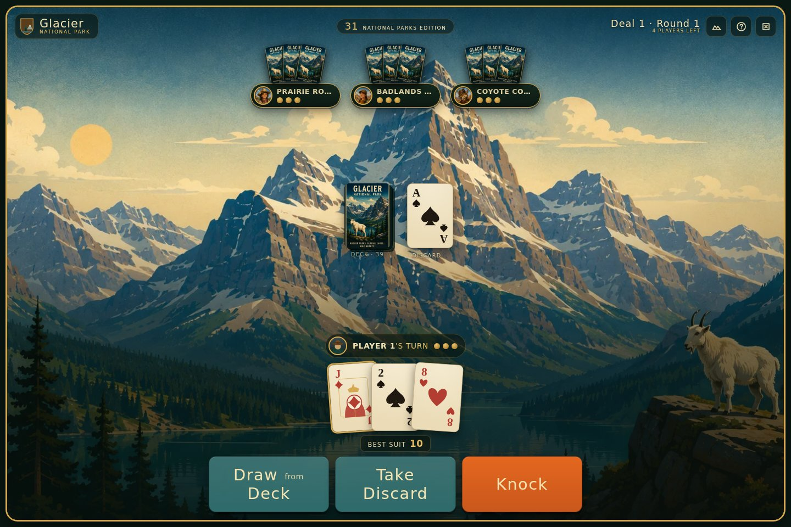
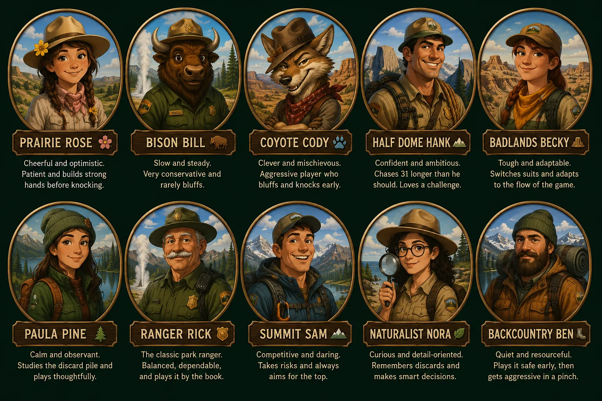
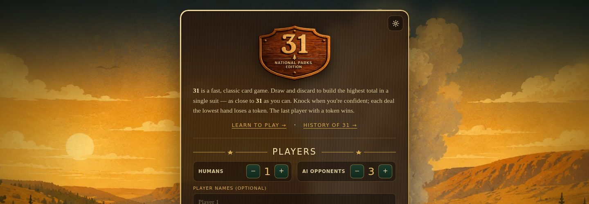
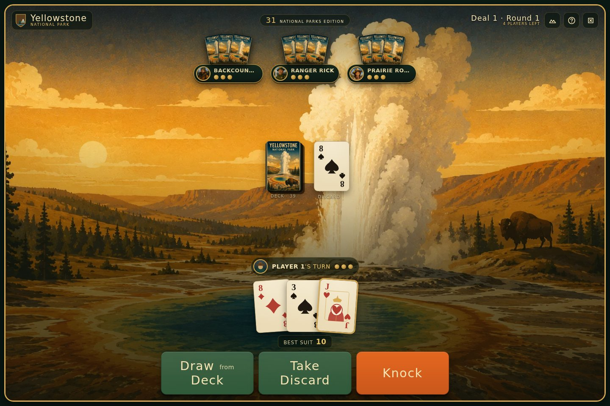
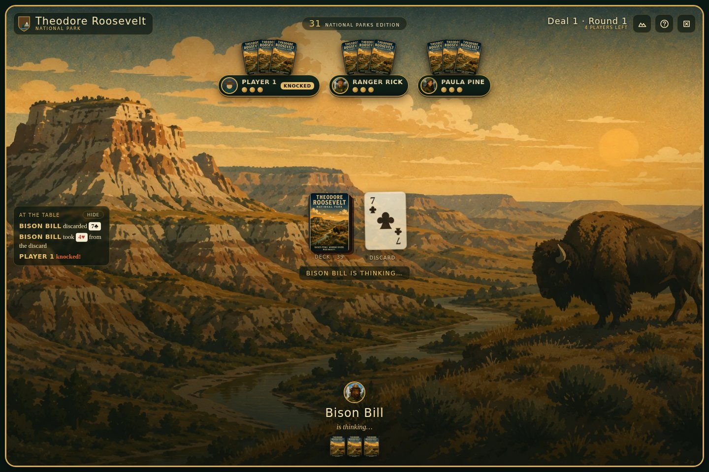

# 31 · National Parks Edition

[](https://play31.fun)
[](https://github.com/randalrausch/31-parks-edition/actions/workflows/ci.yml)
[](https://github.com/randalrausch/31-parks-edition/releases)
[](LICENSE)

**31** is the classic push-your-luck card game: draw, discard, and build the
highest hand you can in a single suit before someone knocks. This is a free,
open-source implementation you can play solo against AI opponents, pass around
one device with friends, or host online — themed for America's national
parks, with ten AI opponents who each have their own personality.

**▶ [Play it now at play31.fun](https://play31.fun)** — or clone it and you're
playing locally in under a minute. No installs, no accounts, no ads.

<p align="center">
  
</p>

## How to play

> Hold three cards. On your turn, draw one and discard one. Collect the
> highest total you can in a single suit — 31 is perfect. Knock when you're
> confident; whoever has the lowest hand loses a token. Last player holding a
> token wins.

Full rules, with the odd edge cases explained, live in the in-app **Learn to
Play** screen — no need to read a manual first.

## Three ways to play

| Mode | Who it's for | Prerequisites |
|------|---------|--------------|
| **Solo vs. AI** | You, against opponents with real personalities | None |
| **Pass-and-play** | 2–8 people around one screen, with hidden-hand cover screens between turns | None |
| **Online** | Friends on their own devices, live or play-at-your-own-pace | A free backend — see below |

Solo and pass-and-play work the moment the page loads. Online play needs a
backend, and there's a zero-cost option (details in [Running it](#running-it-from-local-to-online)).

## Meet your opponents

Each AI has a name, a home park, a catchphrase, and a five-trait personality
(bluff, memory, patience, aggression, risk) that actually drives how it plays
— Bison Bill really won't bluff you, and Coyote Cody really will knock on a
17 just to see what happens.

<p align="center">
  
</p>

Pick any of the ten by name before you start, or let the table fill in
randomly.

## What it looks like

Three national parks are playable today, each with its own scene, palette,
and card backs — pick one on the home screen or let it surprise you.

<p align="center">
  
  
  
</p>

## Features

- A complete game of 31: draw/discard/knock, Grace, the knock penalty,
  instant 31, elimination, and an end-of-game score chart.
- Ten AI opponents with distinct personalities, not just difficulty sliders.
- Pass-and-play for 2–8 humans on one device, with cover screens so nobody
  peeks at another player's hand.
- Themed for America's national parks (Glacier, Yellowstone, Theodore
  Roosevelt so far) with original art — and a documented path to add your
  own. More art — new parks, opponent portraits, card backs — is always
  welcome; see [For contributors](#for-contributors).
- Optional online multiplayer, server-authoritative so no one can see cards
  they shouldn't. Take your turn whenever; the game waits for you.
- Installable as a PWA; solo play works fully offline.
- The rules engine is pure, tested TypeScript with a fuzz-tested suite — see
  [For contributors](#for-contributors) if that's the interesting part to you.

## Running it: from local to online

There are two levels: run it locally, and — when you're ready — put it
online for friends who aren't in the room.

### 1. Run it locally (no setup)

Requires Node 22+.

```bash
git clone https://github.com/randalrausch/31-parks-edition.git
cd 31-parks-edition
npm install
npm run dev          # http://localhost:5173
```

Solo vs. AI and local pass-and-play work immediately — no configuration, no
accounts. Choose how many humans and AI opponents to seat and start the game;
with two or more humans you pass the device between turns behind a hidden-hand
cover screen.

To play the production build instead of the dev server:

```bash
npm run build && npm run preview
```

### 2. Put it online

Online play needs a **backend** for the authoritative game server, plus a
**static host** for the site itself. Two backend implementations ship with
the project — pick one to get going, or use it as a reference for your own:

- **Azure (Functions + Table Storage)** — the fastest path to a running
  online game. One command provisions and deploys everything, scales to zero
  when idle, and auto-wakes with no manual un-pausing:

  ```bash
  npm run azure:up   # or: azd up
  ```

  See [docs/AZURE.md](docs/AZURE.md).

- **Supabase (Edge Function + Postgres) + any static host** (Netlify, Vercel,
  Cloudflare, …) — a good fit if you're already on Supabase. Set it up with:

  ```bash
  npm run supabase:setup
  ```

  See [docs/SUPABASE.md](docs/SUPABASE.md) and [docs/DEPLOY.md](docs/DEPLOY.md).
  Note a free Supabase project **pauses after 7 days idle** and needs a
  manual un-pause from its dashboard.

Either one enforces hidden hands server-side. Without a backend configured,
the site still builds and serves solo + pass-and-play — the online buttons
just don't appear.

## For contributors

This project is as much an invitation to add a park, an opponent, or a rule
variant as it is a game to play. Contributions of all kinds are welcome —
bug fixes, features, docs, and especially **new park themes**.

- **Add a national park** — the highest-leverage contribution. It's mostly
  art plus a color palette plus one registry entry; no code changes required
  for the easy path. See [docs/THEMES.md](docs/THEMES.md).
- **Contribute artwork** — new park scenes, AI opponent portraits, card backs,
  emblems. You don't need to touch any code to help here; drop art in and open
  a PR, or post it on an issue and someone can wire it in.
- **Add or tune an AI opponent** — one entry in
  [`src/game/aiCharacters.ts`](src/game/aiCharacters.ts): a name, a
  catchphrase, and five trait numbers.
- **Fix a bug or propose a rule variant** — the game rules live in one place
  (`src/game/engine.ts`, `actions.ts`, `authority.ts`), shared by both front
  ends and both backends, so a fix lands everywhere at once.

Start with [CONTRIBUTING.md](CONTRIBUTING.md) for the dev workflow, coding
conventions, and PR checklist. Ideas and bugs go in the
[issue tracker](https://github.com/randalrausch/31-parks-edition/issues).

### Project structure

```text
src/
  game/            Framework-free game core (engine, reducer, AI, transports)
    engine.ts        Rules: scoring, tokens/grace, AI trait-to-behaviour mappings
    actions.ts       Pure reducer: applyAction(state, action) — the authority
    authority.ts     Server brain: redactState / advanceAuthority / applyPlayerAction
    useGame.ts       Solo presentation layer over the reducer (animation, AI, sound)
    transport.ts     Transport interface + LocalTransport
    networkTransport.ts / useNetworkGame.ts   Online sync over Supabase
    aiCharacters.ts  The ten AI opponents: flavor + trait profile
    *.test.ts        Unit and fuzz tests
  components/       React UI (board, lobby, setup, overlays)
  art/             Original SVG scenes, emblems, avatars, glyphs
  themes.ts        The park theme registry  (add a park here)
  assets/          Raster art (park scenes, character portraits, audio, sfx)
api/               Azure Functions backend — the authority (optional Azure path)
supabase/          Schema migration and the `game` Edge Function (optional Supabase path)
infra/             Bicep for the Azure backend (`azd up`)
docs/              Architecture, theming, backend, and deployment guides
```

### Documentation

- [docs/](docs/README.md) — the full documentation index, including
  [Architecture Decision Records](docs/adr/) that capture the *why* behind the
  shared engine, the two-backend seam, and the wire `PROTOCOL_VERSION`.
- [docs/ARCHITECTURE.md](docs/ARCHITECTURE.md) — how the pure engine, reducer,
  transports, and authority fit together, and how hidden information is
  enforced.
- [docs/TESTING.md](docs/TESTING.md) — the test layering (unit/fuzz → local E2E
  → live-site deployment smoke) and what each layer covers.
- [docs/THEMES.md](docs/THEMES.md) — how to add your own national park theme.
- [docs/AZURE.md](docs/AZURE.md) — the optional **Azure** backend (Functions +
  Table Storage + Static Web Apps) via one `azd up`; scales to zero and
  auto-wakes.
- [docs/SUPABASE.md](docs/SUPABASE.md) — the optional **Supabase** backend
  (Edge Function + Postgres) with a one-command helper script.
- [docs/DEPLOY.md](docs/DEPLOY.md) — deploy the static build to any host.
- [CONTRIBUTING.md](CONTRIBUTING.md) — dev workflow, tests, and conventions.
- [ROADMAP.md](ROADMAP.md) — where the project is headed (and easy first tasks).
- [SUPPORT.md](SUPPORT.md) — where to get help or report a problem.

### Scripts

`npm` is the single entry point for every target — no Makefile needed.

| Script | What it does |
|--------|--------------|
| `npm run dev` | Start the dev server (solo/pass-and-play; online if env vars set) |
| `npm run check` | **The whole fast gate in one:** format check + typecheck + lint + tests + build |
| `npm run build` | Type-check and build a static bundle to `dist/` |
| `npm run preview` | Serve the production build locally |
| `npm test` | Run the unit + fuzz test suite (Vitest) |
| `npm run test:e2e` | Real-browser E2E against a local production build (Playwright) — solo, a11y, and an online round vs. a local in-memory backend |
| `npm run test:e2e:deploy` | Play a **live deployed** site end-to-end (`E2E_BASE_URL=…`) |
| `npm run typecheck` | Type-check only |
| **Azure backend** | |
| `npm run api:install` / `api:build` / `api:test` | Install / bundle / test the Functions app (`api/`) |
| `npm run api:start` | Run the Functions host locally (`func start`) |
| `npm run dev:online:azure` | SWA CLI: Vite + local `/api` proxy (online dev) |
| `npm run azure:up` | `azd up` — provision + deploy the whole Azure stack |
| `npm run azure:deploy` | Build the api and `azd deploy` |
| **Supabase backend** | |
| `npm run build:edge` | Re-bundle the shared engine for the Supabase Edge Function |
| `npm run supabase:setup` | One-command Supabase project setup |
| `npm run supabase:deploy` | Bundle the engine + deploy the `game` Edge Function |
| `npm run supabase:push` | Apply DB migrations |
| **Static hosting** | |
| `npm run netlify:deploy` | Build and upload `dist/` to Netlify |

**Automated deploys (GitHub Actions):** on push to `main`, each deploy target
is an **independent, opt-in** repo variable — set any combination:
`DEPLOY_SUPABASE=true` (Supabase backend) and `DEPLOY_NETLIFY=true` (Netlify
frontend) ship that stack, while `DEPLOY_AZURE=true` ships the Azure Function
App + Static Web App (the `deploy-azure` job in `ci.yml`). Enable one stack, both
side by side, or none — with no flags set, nothing deploys. The build-and-test
quality gate still runs on every push for **both** back ends regardless, so
parity can't silently rot. See [docs/DEPLOY.md](docs/DEPLOY.md) and
[docs/AZURE.md](docs/AZURE.md).

**Testing the deployment (play the real thing):** `npm run test:e2e:deploy`
drives a real browser against a *live* URL and actually plays the game — it
boots, plays a solo turn, and runs a **two-browser online round** (host
creates a room, a second browser joins by code, the host starts, and a turn is
taken) against the deployed backend, verifying create/join/start/act and
per-seat hand redaction end to end. Point it at any deployment:

```sh
E2E_BASE_URL=https://play31.fun npm run test:e2e:deploy
```

The Azure deploy workflow runs this automatically after each deploy against
the `AZURE_SITE_URL` repo variable, so a broken deploy fails loudly instead of
silently serving a dead site.

## Under the hood

If you're here for how the project is put together rather than to play it:
one rules engine in `src/game/` is shared, unforked, by two front ends (solo
and online boards) and two backends (Azure Functions and a Supabase Edge
Function), so the four surfaces can't drift out of sync with each other. Both
backends run the same op layer, router, and rate limiter — only the storage
adapter differs. A single `PROTOCOL_VERSION` keeps client and server honest
about the wire contract, CI runs the full quality gate for *both* backends on
every push, and releases are cut automatically from
[Conventional Commits](https://www.conventionalcommits.org/) — no hand-edited
version numbers. Full breakdown in
[docs/ARCHITECTURE.md](docs/ARCHITECTURE.md).

## Tech

React 19, TypeScript, Vite 8, plain CSS, Supabase (optional, for multiplayer),
and Vitest. There are no game-logic dependencies; the rules are pure,
serializable TypeScript shared by the client and the server.

Runs on any evergreen browser; the practical floor is Safari 15.4+ / Chrome
90+ / Firefox 90+ (a small shim backfills `AbortSignal.timeout` for the
oldest of those).

## Credits and license

All original artwork in `src/assets/` and `docs/images/` (park scenes, opponent
portraits, card backs, emblems) is created for this project and released under
the same [MIT License](LICENSE) as the code. It's inspired by the public-domain
visual language of 1930s WPA national-park posters; no copyrighted poster art is
used. The bundled sound effects are CC0/public-domain samples (with a synthesized
fallback); any replacements should also be CC0 (see `src/assets/sfx/README.md`).

Licensed under the [MIT License](LICENSE).
